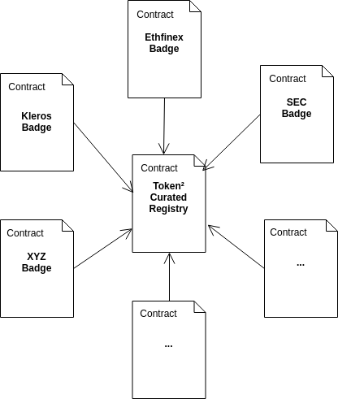

# Token² Curated Registry & Badges

Demo: https://codesandbox.io/s/zl98y8ojm4

A decription of the architecure and rationale is provided below.



## T²CR Contract

The T2CR contract contains all token submissions. A token submission contains the token's data along with additional information:

- Name - The token's name (e.g. Pinakion).
- Ticker - The token's ticker (e.g. PNK).
- Address - The token's address.
- Symbol Multihash - The multihash of the image with the token symbol, using the keccak-256 hash function.
- Network ID - The ID of the network where the token is deployed on.
- Status - The status of the token on the TCR. A status can be Absent, Registered, Registration Requested and Clearing Requested. A submission with the status of Registered or Clearing Requested are considered to be present on the TCR.
- Number of Requests - The number of requests ever made for changing the status of the submission.

#### Symbol Multihash

The symbol multihash uniquely identifies the token symbol image. It can be used to verify and/or fetch the symbol stored off chain:

`https://staging-cfs.s3.us-east-2.amazonaws.com/BcczM5HCLj24wSWU6tDUpnVrbrxJNj7dwdjnUkaRpLXDFztUMjuMRfESGgYfW5guE3yXYAP71awL39LmSixrSMYgig`


> **Tip**: You can use the [archon](https://archon.readthedocs.io/en/latest/hashing.html) library provided by Kleros to calculate multihashes: `const fileMultihash = archon.utils.multihashFile(fileData, 0x1b) // 0x1b is the keccak-256`


#### Token ID

Each submission is identified by an ID, which is the keccak-256 hash of the token's [tighly packed](https://solidity.readthedocs.io/en/develop/abi-spec.html#non-standard-packed-mode) data. It can be computed with web3js 1.0 [`soliditySha3()`](https://web3js.readthedocs.io/en/1.0/web3-utils.html?highlight=soliditySha3#soliditysha3) as follows:

```
const ID = web3.utils.soliditySha3(
  'Pinakion',
  'PNK',
  '0x93ED3FBe21207Ec2E8f2d3c3de6e058Cb73Bc04d',
  'Bcd5wH5qLUockaKGA4qAV5i7MrsboyEcfx1fKpb3e2V2SApNdXbpDyUEAmsdqfv8VJvyNrhkY3VpSckkrBUoms5PDg',
  'ETH'
)
```

### Requests

Adding or removing a token from the TCR requires making a request for status change, which can in turn be challenged by parties that disagree with the request. The dispute that arises from the disagreement is resolved by Kleros.

## Badge Contract

The badge contract is a TCR of token addresses. This means that, like the T²CR contract, adding or removing a badge from a token means sending a request to remove or add a token's address to the registry.

## Demo

To interact with the contracts, we must use the injected web3 and get a reference to each contract:

```
const web3 = new Web3(window.web3.currentProvider);
const t2crContract = new web3.eth.Contract(
  t2crABI,
  "0x7a2e4142f573994f76ffe9d8236ba141beed2810"
);
const badgeContract = new web3.eth.Contract(
  badgeABI,
  "0x1f28f15360c4ebbec6abf90ae57fabe7423d040c"
);
this.setState({ web3, t2crContract, badgeContract });
```
With the token instances, we can get information on all tokens that have a badge:

### 1. Get token addresses

First, we must get the addresses of tokens that have the badge. To do so, we use the `queryAddresses` method.

#### queryAddresses() Parameters
1. `_cursor` - string/ethereum address - This is the address from which to start or end our query. Passing the `0x0000000000000000000000000000000000000000` address means the query will start from either the end or the start of the list, depending on the `oldestFirst` parameter.
2. `_count` - number - This is the number of items that will be returned. Since the contract always returns fixed numbers, any unused slots will be returned as with the `0x0000000000000000000000000000000000000000` address.
3. `_filter` - Array - Array of bool to use as filter to use to query the tokens. Each position meaning is described below:
  - 0. Do not include absent tokens.
  - 1. Include registered tokens.
  - 2. Do not include tokens with registration requests.
  - 3. Include tokens with clearing requests.
  - 4. Do not include tokens with challenged registration requests.
  - 5. Include tokens with challenged clearing requests.
  - 6. Include token if caller is the author of a pending request.
  - 7. Include token if caller is the challenger of a pending request.
4. `_oldestFirst` - bool - Whether to return the oldest submissions first.

#### queryAddresses() Return
```
`Object`:
  `values`: - Array - The addresses of tokens that have the badge.
  `hasMore` - bool - Whether there are more items after the last or first returned item.
```

#### Demo

```
// Fetch addresses of tokens that have the badge.
// Since the contract returns fixed sized arrays, we must filter out unused items.
const addressesWithBadge = (await badgeContract.methods
  .queryAddresses(
    zeroAddress, // A token address to start/end the query from. Set to zero means unused.
    100, // Number of items to return at once.
    filter,
    true // Return oldest first.
  )
  .call()).values.filter(address => address !== zeroAddress);
```

### 2. Get token IDs

With the token addresses, we can query the token² curated list contract to get token id submissions currently on the list. To do that, we use the `queryTokens` method.

#### queryTokens() Parameters
1. `_cursor` - string/tokenID - This is the token ID from which to start or end our query. Passing the `0x0000000000000000000000000000000000000000000000000000000000000000` ID means the query will start from either the end or the start of the list, depending on the `oldestFirst` parameter.
2. `_count` - number - This is the number of items that will be returned. Since the contract always returns fixed numbers, any unused slots will be returned as with the `0x0000000000000000000000000000000000000000000000000000000000000000` address.
3. `_filter` - Array - Array of bool to use as filter to use to query the tokens. Each position meaning is described below:
  - 0. Do not include absent tokens.
  - 1. Include registered tokens.
  - 2. Do not include tokens with registration requests.
  - 3. Include tokens with clearing requests.
  - 4. Do not include tokens with challenged registration requests.
  - 5. Include tokens with challenged clearing requests.
  - 6. Include token if caller is the author of a pending request.
  - 7. Include token if caller is the challenger of a pending request.
4. `_oldestFirst` - bool - Whether to return the oldest submissions first.
5. `_address` - The address of the token for which to query token IDs. If set to `0x0000000000000000000000000000000000000000000000000000000000000000`, queries the whole token² curated list.

#### queryTokens() Return
```
`Object`:
  `values`: - Array - The token IDs of token submissions.
  `hasMore` - bool - Whether there are more items after the last or first returned item.
```

#### Example:

```
// Fetch the token submission IDs on the T2CR using the token addresses.
// As with addresses, the contract returns a fixed sized array so we filter out unused slots.
const submissionIDs = [].concat(
  ...(await Promise.all(
    addressesWithBadge.map(address =>
      t2crContract.methods
        .queryTokens(
          zeroSubmissionID, // A token ID from which to start/end the query from. Set to zero means unused.
          100, // Number of items to return at once.
          filter,
          true, // Return oldest first.
          address // The token address for which to return the submissions.
        )
        .call()
        .then(res => res.values.filter(ID => ID !== zeroSubmissionID))
    )
  ))
);
```

### 3. Get token data

With the token IDs, we can get token information from the t²cr contract with the `getTokenInfo` method.

#### getTokenInfo() Parameters

1. `_tokenID` - string/tokenID - This is the token ID for which the data will be fetched.

#### getTokenInfo () Returns
```
`Object`:
  name - string - The token's name (e.g. Pinakion).
  ticker - string - The token's ticker (e.g. PNK).
  address - string/Etheruem address - The token's address.
  symbolMultihash - string - The multihash of the image with the token symbol, using the keccak-256 hash function.
  networkID - string - The ID of the network where the token is deployed on.
  status - string - The status of the token on the TCR. A status can be Absent, Registered, Registration Requested and ClearingRequested. A submission with the status of Registered or Clearing Requested are considered to be present on the TCR.
  numberOfRequests - string - The number of requests ever made for changing the status of the submission.
```

#### Example

```
// With the token IDs, get the information and add it to the object.
const tokenData = (await Promise.all(
  submissionIDs.map(ID => t2crContract.methods.getTokenInfo(ID).call())
)).reduce((acc, submission) => {
  if (acc[submission.addr]) acc[submission.addr].push(submission);
  else acc[submission.addr] = [submission];
  return acc;
}, {});
```