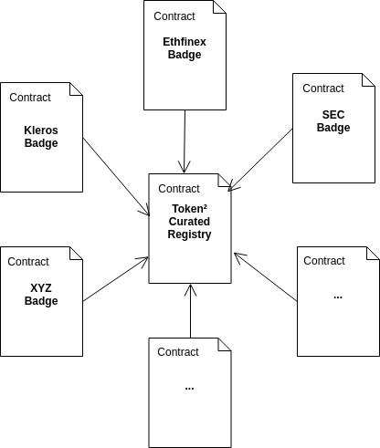

## Introduction

The Token² Curated Registry \(or sometimes refered to as the T²CR\) is a Kleros powered token curated registry of tokens.

Additionally, badges can also be attached to tokens that meet some criteria \(e.g. ERC20 Badge certifies that the token contract implements the ERC20 token standard and passed a bug bounty\).



## Resources

The links below provide a background on the uses of the T²CR, badges and how the protocol works.

* [https://blog.kleros.io/decentralize-your-exchange-listing-process-with-kleros/](https://blog.kleros.io/decentralize-your-exchange-listing-process-with-kleros/)
* [https://blog.kleros.io/kleros-ethfinex-tcr-an-explainer/](https://blog.kleros.io/kleros-ethfinex-tcr-an-explainer/)
* [https://blog.kleros.io/erc20-becomes-part-of-the-token/](https://blog.kleros.io/erc20-becomes-part-of-the-token/)
* [https://blog.kleros.io/tokens-on-trial-some-early-learnings-about-decentralized-justice-this-is-what-were-learning-from-the-first-ever-community-driven-court/](https://blog.kleros.io/tokens-on-trial-some-early-learnings-about-decentralized-justice-this-is-what-were-learning-from-the-first-ever-community-driven-court/)

### Contracts

The T2CR contract contains all token submissions. A token submission contains the token's data its current status and request history.

* Name - The token's name \(e.g. Pinakion\).
* Ticker - The token's ticker \(e.g. PNK\).
* Address - The token's address.
* Symbol Multihash - The multihash of the image with the token symbol, using the keccak-256 hash function.

**Symbol Multihash**

This is the IPFS identifier of the token symbol image, used to verify and/or fetch the from off chain storage:

```text
// Pinakion (PNK) IPFS URI
/ipfs/QmUEdcZHCPwtogM9DhxU4jTbJqTDRdpxjYRazgogLjQwcR/BccyC34GA7AwHVvDTn5qNFTn4WyTkcuMvhBkwryERLvsaTTso3sPyXbrETstLTZFihsYqFBrZ3KpK8NYxTejS6muzk

// Fetching via
https://ipfs.kleros.io/ipfs/QmUEdcZHCPwtogM9DhxU4jTbJqTDRdpxjYRazgogLjQwcR/BccyC34GA7AwHVvDTn5qNFTn4WyTkcuMvhBkwryERLvsaTTso3sPyXbrETstLTZFihsYqFBrZ3KpK8NYxTejS6muzk
```

> You can use the [archon](https://archon.readthedocs.io/en/latest/hashing.html) library provided by Kleros to calculate multihashes:
```
const fileMultihash = archon.utils.multihashFile(fileData, 0x1b) // 0x1b is the keccak-256
```

#### Token ID

Each submission is identified by an ID, which is the keccak-256 hash of the token's [tighly packed](https://solidity.readthedocs.io/en/develop/abi-spec.html#non-standard-packed-mode) data. It can be computed with web3js 1.0 [`soliditySha3()`](https://web3js.readthedocs.io/en/1.0/web3-utils.html?highlight=soliditySha3#soliditysha3) as follows:

```text
const ID = web3.utils.soliditySha3(
  'Pinakion',
  'PNK',
  '0x93ED3FBe21207Ec2E8f2d3c3de6e058Cb73Bc04d',
  '/ipfs/QmUEdcZHCPwtogM9DhxU4jTbJqTDRdpxjYRazgogLjQwcR/BccyC34GA7AwHVvDTn5qNFTn4WyTkcuMvhBkwryERLvsaTTso3sPyXbrETstLTZFihsYqFBrZ3KpK8NYxTejS6muzk',
  'ETH'
)
```

### Requests

Adding or removing a token from the TCR requires making a request for status change, which can in turn be challenged by parties that disagree with the request. The dispute that arises from the disagreement is resolved by Kleros.

## Badge Contract

The badge contract is a TCR of token addresses. This means that, like the T²CR contract, adding or removing a badge from a token means sending a request to remove or add a token's address to the registry.

## Web3 Example

```text
const t2crContract = new web3.eth.Contract(
  t2crABI,
  "0x7a2e4142f573994f76ffe9d8236ba141beed2810"
);
const badgeContract = new web3.eth.Contract(
  badgeABI,
  "0x1f28f15360c4ebbec6abf90ae57fabe7423d040c"
);
this.setState({ web3, t2crContract, badgeContract });
```

With the token instances, we can get information on all tokens that have a badge:

### 1. Get token addresses

First, we must get the addresses of tokens that have the badge. To do so, we use the `queryAddresses` method.

#### queryAddresses\(\) Parameters

1. `_cursor` - string/ethereum address - This is the address from which to start or end our query. Passing the `0x0000000000000000000000000000000000000000` address means the query will start from either the end or the start of the list, depending on the `oldestFirst` parameter.
2. `_count` - number - This is the number of items that will be returned. Since the contract always returns fixed numbers, any unused slots will be returned as with the `0x0000000000000000000000000000000000000000` address.
3. `_filter` - Array - Boolean array to use as filter when quering the tokens.
4. `_oldestFirst` - bool - The sort order of the returned values.

#### queryAddresses\(\) Return

```text
`Object`:
  `values`: - Array - The addresses of tokens that have the badge.
  `hasMore` - bool - Whether there are more items after or before the last returned item.
```

#### Demo

```text
// Fetch addresses of tokens that have the badge.
// Since the contract returns fixed sized arrays, we must filter out unused items.
const addressesWithBadge = (await badgeContract.methods
  .queryAddresses(
    zeroAddress, // A token address to start/end the query from. Set to zero means unused.
    100, // Number of items to return at once.
    filter,
    true // Return oldest first.
  )
  .call()).values.filter(address => address !== zeroAddress);
```

### 2. Get token IDs

With the token addresses, we can query the token² curated list contract to get token id submissions currently on the list. To do that, we use the `queryTokens` method.

#### queryTokens\(\) Parameters

1. `_cursor` - string/tokenID - This is the token ID from which to start or end our query. Passing the empty ID \(`0x0000000000000000000000000000000000000000000000000000000000000000`\) ID means the query will start from either the end or the start of the list, depending on the `oldestFirst` parameter.
2. `_count` - number - This is the number of items that will be returned. Since the contract returns fixed numbers, any unused slots will be returned as with the empty \(`0x0000000000000000000000000000000000000000000000000000000000000000`\) ID.
3. `_filter` - Array - Boolean array to use as filter when quering the tokens.
4. `_oldestFirst` - bool - The sort order of the returned values.
5. `_address` - The address of the token for which to query token IDs. If set to `0x0000000000000000000000000000000000000000000000000000000000000000`, queries the whole token² curated list.

#### queryTokens\(\) Return

```text
`Object`:
  `values`: - Array - The token IDs of token submissions.
  `hasMore` - bool - Whether there are more items after or before the last returned item.
```

#### Example:

```text
// Fetch the token submission IDs on the T2CR using the token addresses.
// As with addresses, the contract returns a fixed sized array so we filter out unused slots.
const submissionIDs = [].concat(
  ...(await Promise.all(
    addressesWithBadge.map(address =>
      t2crContract.methods
        .queryTokens(
          zeroSubmissionID, // A token ID from which to start/end the query from. Set to zero means unused.
          100, // Number of items to return at once.
          filter,
          true, // Return oldest first.
          address // The token address for which to return the submissions.
        )
        .call()
        .then(res => res.values.filter(ID => ID !== zeroSubmissionID))
    )
  ))
);
```

### 3. Get token data

With the token IDs, we can get token information from the t²cr contract with the `getTokenInfo` method.

> The function below returns information for a single token. If you need to return information on a lot of tokens, you should batch the request using a view contract. See [this example](https://codesandbox.io/s/t2cr-and-badges-nyqi6) learn how we do this.


#### getTokenInfo\(\) Parameters

1. `_tokenID` - string/tokenID - This is the token ID for which the data will be fetched.

#### getTokenInfo \(\) Returns

```text
`Object`:
  name - string - The token's name (e.g. Pinakion).
  ticker - string - The token's ticker (e.g. PNK).
  address - string/Etheruem address - The token's address.
  symbolMultihash - string - The multihash of the image with the token symbol, using the keccak-256 hash function.
  status - string - The status of the token on the TCR. A status can be Absent, Registered, Registration Requested and ClearingRequested. A submission with the status of Registered or Clearing Requested are considered to be present on the TCR.
  numberOfRequests - string - The number of requests ever made for changing the status of the submission.
```

#### Example

```text
// With the token IDs, get the information and add it to the object.
const tokenData = (await Promise.all(
  submissionIDs.map(ID => t2crContract.methods.getTokenInfo(ID).call())
)).reduce((acc, submission) => {
  if (acc[submission.addr]) acc[submission.addr].push(submission);
  else acc[submission.addr] = [submission];
  return acc;
}, {});
```
